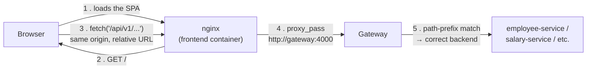

# PeopleOS — Deployment Guide

> How the frontend gets wired up to every backend service, how to deploy the whole platform, and how
> to verify it's actually working end-to-end afterward. Pairs with
> [`TECHNICAL_OVERVIEW.md`](TECHNICAL_OVERVIEW.md), which explains the architecture in depth — this
> file is the operational "how do I actually run this" companion.

## Table of Contents

1. [TL;DR](#1-tldr)
2. [How the Frontend Connects to Every Service](#2-how-the-frontend-connects-to-every-service)
3. [Prerequisites](#3-prerequisites)
4. [Step-by-Step Deployment](#4-step-by-step-deployment)
5. [Verifying It Actually Works (Smoke Test)](#5-verifying-it-actually-works-smoke-test)
6. [Production Hardening Checklist](#6-production-hardening-checklist)
7. [Troubleshooting Connectivity Problems](#7-troubleshooting-connectivity-problems)
8. [Updating / Redeploying After a Code Change](#8-updating--redeploying-after-a-code-change)
9. [Scaling Beyond One Server](#9-scaling-beyond-one-server)

---

## 1. TL;DR

```bash
git clone <your-repo-url> && cd hr_payroll
cp .env.example .env
python scripts/setup_env.py      # auto-fills every CHANGE_ME secret in .env
docker compose up -d --build
```

Wait ~30–60 seconds for Postgres and MinIO to become healthy, then open **http://localhost:4050**.
That's the whole deployment — one `.env` file and one `docker compose` command bring up the frontend,
the gateway, all 11 backend services, Postgres, and MinIO, **already wired together**. Nothing else to
configure for a single-server deployment. The rest of this guide explains *why* that's enough, how to
verify it worked, and what to change if you need more than one server.

---

## 2. How the Frontend Connects to Every Service

This is the part that usually causes confusion, so it's worth being explicit: **the React frontend
does not know any backend service exists except one — the gateway.** It never talks to
employee-service, payroll-service, or any other service by name or port.



Three layers make this work, and each one only needs to know about the layer directly next to it:

**Layer 1 — the frontend build never hardcodes a host.**
`frontend/src/lib/api.ts` sets its Axios base URL to `/api/v1` — a *relative* path, not
`http://something:4000/api/v1`. That single line is why the exact same built Docker image works
whether it's served from `localhost:4050`, a staging domain, or a production domain: it always calls
"wherever this page was loaded from, plus `/api/v1`."

**Layer 2 — nginx (inside the frontend container) proxies `/api/` to the gateway.**
`frontend/nginx.conf`:
```nginx
location /api/ {
    proxy_pass http://gateway:4000;
    ...
}
```
`gateway` here is not a hostname you configure — it's the Docker Compose **service name**, which Docker's
built-in DNS resolves automatically to whichever container is running that service, on the shared
`hr_payroll` compose network. This is the mechanism that connects the frontend container to the
backend without either one needing an IP address, a `.env` entry, or a load balancer.

**Layer 3 — the gateway fans a request out to the correct backend by path prefix.**
`services/gateway/app/settings.py::ROUTES` is a simple ordered list:
```python
ROUTES = [
    ("/api/v1/auth",       settings.auth_url),        # → http://auth-service:4001
    ("/api/v1/employees",  settings.employee_url),    # → http://employee-service:4002
    ("/api/v1/salary",     settings.salary_url),      # → http://salary-service:4003
    ("/api/v1/payroll",    settings.payroll_url),     # → http://payroll-service:4005
    ...
]
```
Every one of those `*_url` values is itself just `http://<compose-service-name>:<port>` — same DNS
trick as layer 2, one level deeper. **This is the entire answer to "how do I connect all the services
to the frontend": you don't, individually.** You bring every container up on the same Compose network
(`docker compose up`), and the gateway's routing table plus nginx's single proxy rule connect
everything automatically. There is no per-service frontend configuration to maintain.

The one place this *does* require you to think is if you ever split the frontend and the gateway
across two different **domains** (not just containers) — see
[§6](#6-production-hardening-checklist) and [§9](#9-scaling-beyond-one-server).

---

## 3. Prerequisites

| Requirement | Notes |
|---|---|
| **Docker Engine + Docker Compose v2** | `docker compose version` should print something; the plugin (not the old standalone `docker-compose`) is what this project's `docker compose ...` commands expect. |
| **A machine with enough headroom** | 12 containers total (11 Python services + gateway + frontend + Postgres + MinIO + a one-shot init job). Comfortable minimum: **4 vCPU / 8 GB RAM / 20 GB disk**. It will technically start on less, but WeasyPrint (PDF rendering) and concurrent payroll runs are the components that spike CPU/RAM hardest. |
| **Python 3** on the host (optional) | Only needed if you run `scripts/setup_env.py` or `scripts/seed.py` from the host rather than inside a container. |
| **Open ports** | Only **4050** (frontend) and **4000** (gateway) need to be reachable from wherever your users/browsers are. Every other port (Postgres 5432, MinIO 9000/9001, all 11 backend services) is intentionally *not* published to the host — see the table in [TECHNICAL_OVERVIEW.md §5](TECHNICAL_OVERVIEW.md#5-the-services). Don't "fix" this by adding `ports:` entries for them; it would remove a real security boundary for no benefit, since nginx and the gateway are the only supported entry points. |

---

## 4. Step-by-Step Deployment

### 4.1 Get the code and configure secrets

```bash
git clone <your-repo-url>
cd hr_payroll
cp .env.example .env
```

`.env` holds every secret the stack needs: `JWT_SECRET` (signs every login token),
`FIELD_ENCRYPTION_KEY` (encrypts PAN/Aadhaar/bank details at rest — see
[TECHNICAL_OVERVIEW.md §10](TECHNICAL_OVERVIEW.md#10-security--compliance-measures)), and the MinIO
root + service-account credentials. **Never commit `.env`** — it's git-ignored on purpose;
`.env.example` (the template, with no real secrets) is the file that's committed.

Fill in the `CHANGE_ME_*` placeholders. The fastest way:
```bash
python scripts/setup_env.py
```
This generates cryptographically random values for every `JWT_SECRET`/`FIELD_ENCRYPTION_KEY`/MinIO
credential placeholder and writes them into `.env` for you — it refuses to overwrite an existing
`.env`, so it's safe to run once right after cloning. If you'd rather do it by hand, the generation
commands are documented at the top of `.env.example` itself (`secrets.token_urlsafe(32)` for
passwords/keys, `Fernet.generate_key()` for the encryption key specifically).

### 4.2 Build and start everything

```bash
docker compose up -d --build
```

What happens, in order:
1. **Postgres** starts, and a healthcheck (`pg_isready`) gates everything else — no service starts
   trying to connect to a database that isn't accepting connections yet.
2. **MinIO** starts, then a one-shot **`minio-init`** job runs: it waits for MinIO to be ready, then
   provisions a least-privilege IAM user (`blobstore-svc`) that `blobstore-service` will use at
   runtime. The MinIO *root* credentials never reach any application container — only `minio-init`
   sees them.
3. All 11 **backend services** start (each depends on Postgres being healthy). Each one creates its own
   Postgres schema and tables on startup automatically (`ServiceRuntime.create_all` in
   `shared/hr_shared/service.py`) — there is no separate migration step to remember.
4. The **gateway** starts once every backend service it depends on is up.
5. The **frontend** (nginx + the built React app) starts, proxying to the gateway.

### 4.3 Confirm everything actually came up

```bash
docker compose ps
```
Every service should show `Up` (Postgres and MinIO should show `(healthy)`). If anything shows
`Restarting` or `Exited`, jump to [§7](#7-troubleshooting-connectivity-problems) — don't proceed to
seeding data against a half-up stack.

```bash
curl -s http://localhost:4000/health
```
should return `{"status":"ok","service":"gateway"}`. This one check is a good proxy for "the network
between the frontend, the gateway, and the backend containers is wired correctly" — if this fails,
nothing downstream will work either.

### 4.4 (Optional) Seed demo data

```bash
python scripts/setup_env.py   # if you haven't already
python scripts/seed.py
```
This talks to the gateway from the host (using `GATEWAY_URL` from `.env`, default
`http://localhost:4000`) to register a demo tenant, an admin user, a client company, and some
employees — useful for a first look at the app without configuring everything by hand. Read the
script if you want the exact demo login it prints at the end.

### 4.5 Open the app

**http://localhost:4050** (or `http://<your-server-ip>:4050` if deploying to a remote machine —
remember only ports 4050 and 4000 are exposed). Log in with the credentials `seed.py` printed, or
register a new tenant at `/login` → "Register".

---

## 5. Verifying It Actually Works (Smoke Test)

Standing the containers up is necessary but not sufficient — the checklist below actually exercises the
cross-service wiring described in §2, so a pass here means the frontend is genuinely talking to every
layer correctly, not just that the containers happen to be running.

| # | Action | What it proves |
|---|---|---|
| 1 | Load the app, open the browser console, confirm no failed requests to `/api/v1/...` | nginx → gateway proxying works |
| 2 | Log in | gateway → auth-service, JWT issuance, Postgres write all work |
| 3 | Create a client company (Clients page) | gateway → client-service → its Postgres schema |
| 4 | Add an employee under that client | gateway → employee-service; client-service ↔ employee-service `client_id` linkage |
| 5 | Set the employee's salary (Salary page) | gateway → salary-service |
| 6 | Enter attendance for the current month | gateway → attendance-service |
| 7 | Create and **run** a payroll cycle (Payroll Cycles page) | payroll-service fanning out to salary/attendance/compliance/tds-service — the single most cross-service-dependent action in the app; if this succeeds, virtually everything is correctly wired |
| 8 | **Approve** the cycle | payroll-service → payout-service (batch) and → reporting-service (payslips); also exercises the append-only audit log |
| 9 | Open a payslip / download it as PDF | reporting-service → blobstore-service → MinIO, round-tripped back through the gateway to the browser |
| 10 | Check the Compliance page for the cycle you just ran | compliance-service's computed PF/ESI/PT numbers are visible |

If steps 1–6 pass but step 7 fails, the problem is almost always one specific downstream service being
unreachable or crashed (per-employee failures in a payroll run are isolated and reported individually —
see [TECHNICAL_OVERVIEW.md §11.3](TECHNICAL_OVERVIEW.md#113-running-a-payroll-cycle-the-flagship-workflow)),
so check `docker compose logs payroll-service` for which downstream call actually failed.

---

## 6. Production Hardening Checklist

The default `docker-compose.yml` is honestly built for "one server, get it running correctly" — it is
**not** production-hardened out of the box in a few specific, important ways. Go through this list
before putting real user data behind it:

- [ ] **Put TLS in front of it.** Neither nginx (frontend) nor the gateway terminates HTTPS — the
  frontend's nginx listens on plain port 80/4050. Put a TLS-terminating reverse proxy (Caddy, another
  nginx instance, or your cloud provider's load balancer) in front of port 4050, and don't expose 4050
  directly to the internet unencrypted. JWTs and PII are flowing over that connection.
- [ ] **Regenerate every secret for this environment.** Don't reuse a `.env` generated for local dev.
  Run `scripts/setup_env.py` fresh (or generate manually) for each real environment, and store the
  resulting `.env` somewhere that isn't the git repo (a secrets manager, your platform's env-var
  storage, etc.) — never commit it.
- [ ] **If the frontend and the gateway will be reachable on *different domains*** (rather than the
  recommended single-origin nginx-proxy setup described in §2), two things need updating together:
  - `services/gateway/app/main.py` — the `CORSMiddleware` origin allow-list is currently hardcoded to
    `localhost:4050`/`localhost:4000`. Add your real domain(s) here, or requests from the browser will
    be silently blocked by CORS.
  - The frontend build needs `VITE_API_BASE` set to the gateway's absolute URL (pass
    `--build-arg VITE_API_BASE=https://api.yourdomain.com/api/v1` when building the frontend image —
    see the comment in `frontend/Dockerfile`), since the same-origin relative-path trick from §2 only
    works when both are served from the same origin.
  - Also update `MINIO_CORS_ALLOW_ORIGIN` in `.env` to your frontend's real origin (it defaults to
    `http://localhost:4050` if unset).
- [ ] **If you change `POSTGRES_PASSWORD` in `.env`, also update `DATABASE_URL`.** This one is easy to
  miss: `docker-compose.yml`'s shared `x-common-env` block hardcodes
  `DATABASE_URL: postgresql+asyncpg://hr:hr@postgres:5432/hr_payroll` directly in the YAML — it does
  **not** read `DATABASE_URL` back out of `.env`. Changing `POSTGRES_PASSWORD` alone without also
  editing this line in `docker-compose.yml` will leave every service unable to connect.
- [ ] **Set `restart: unless-stopped`** (or `always`) on each service in `docker-compose.yml` if it
  isn't already set for your Compose version's defaults — you want the stack to survive a host reboot
  or a transient crash without manual intervention.
- [ ] **Back up the two stateful volumes**: `pgdata` (all application data) and `minio-data` (every
  uploaded document and generated payslip PDF). Losing either without a backup is unrecoverable —
  neither is replaceable from anything else in the system.
- [ ] **Set resource limits** (`deploy.resources.limits` per service, or your orchestrator's
  equivalent) so one runaway container (WeasyPrint rendering a huge bulk payslip ZIP is the most
  likely culprit — see [TECHNICAL_OVERVIEW.md §11.4](TECHNICAL_OVERVIEW.md#114-payslips-on-demand-rendering-with-caching))
  can't starve the rest of the stack on a single host.
- [ ] **Increase `ACCESS_TOKEN_MINUTES`** thoughtfully or leave it — there is no refresh-token flow
  (see TECHNICAL_OVERVIEW.md §9), so shortening this too aggressively means real users get logged out
  and have to re-authenticate more often than you might want in production.

---

## 7. Troubleshooting Connectivity Problems

| Symptom | Likely cause | Fix |
|---|---|---|
| Browser shows `502` on some/all `/api/v1/...` calls | The specific backend service the gateway is trying to reach is down, crashed, or still starting | `docker compose ps` to find which container isn't `Up`; `docker compose logs <service>` for why; `docker compose up -d <service>` to restart just that one |
| Every request 401s immediately, even right after logging in | `JWT_SECRET` differs between when the token was issued and now (e.g. you regenerated `.env` without restarting every service, or you're pointing two environments at the same frontend build with different secrets) | Restart the full stack after any `JWT_SECRET` change: `docker compose up -d --force-recreate` |
| A specific service works when called directly on its port but not through the app | You're bypassing the gateway/nginx path and hitting an internal-only port that shouldn't be reachable from outside anyway — this is by design (§3), not a bug | Go through `http://<host>:4000/api/v1/...` or the app itself, not a raw service port |
| CORS errors in the browser console | You're accessing the gateway from an origin not in its allow-list — usually means the frontend and gateway are on different domains without the CORS list updated (§6) | Add your real origin to the `CORSMiddleware` `allow_origins` list in `services/gateway/app/main.py` and rebuild the gateway |
| File upload / payslip download fails with a permissions error | `blobstore-service` can't authenticate to MinIO — usually a mismatch between `MINIO_SERVICE_ACCESS_KEY`/`MINIO_SERVICE_SECRET_KEY` in `.env` and what `minio-init` actually provisioned | Check `docker compose logs minio-init` for provisioning errors; as a last resort, `docker compose down -v` to wipe volumes and let `minio-init` re-provision from scratch (**destroys all stored files — dev/staging only**) |
| Everything 500s immediately after `docker compose up` | A backend service tried to reach Postgres before it finished starting | This should be prevented by the `depends_on: postgres: condition: service_healthy` healthcheck gate, but if you interrupted a first-time startup mid-way, just re-run `docker compose up -d` — it's idempotent |
| Real-time "live" status indicator never shows connected / activity feed doesn't update live | This isn't a misconfiguration — `payroll-service`'s `/events/stream` SSE endpoint is a heartbeat stub in the current version, not a real event push (see [TECHNICAL_OVERVIEW.md §15](TECHNICAL_OVERVIEW.md#15-known-limitations--roadmap)) | Nothing to fix; refresh the page to see new data |
| Bulk payslip ZIP download times out or is very slow | Expected for a cycle whose payslips haven't been pre-generated — rendering N employees' PDFs happens synchronously in that one request | The gateway's proxy timeout is already set to 300s for exactly this reason; if you still hit it, the cycle is large enough to warrant pre-generating payslips at disbursement time (which already happens automatically — see §5 step 8) before bulk-downloading |

---

## 8. Updating / Redeploying After a Code Change

Rebuilding the entire stack for a one-file change is slow and unnecessary. Rebuild and restart just
the service you touched:

```bash
docker compose build <service-name> && docker compose up -d <service-name>
```

Examples: `docker compose build frontend && docker compose up -d frontend` after a UI change;
`docker compose build payroll-service && docker compose up -d payroll-service` after a backend change
to that one service. If you changed `shared/hr_shared/` (the cross-cutting library every service
depends on — see [TECHNICAL_OVERVIEW.md §6](TECHNICAL_OVERVIEW.md#6-the-shared-library-hr_shared)),
you need to rebuild **every** Python service, since each one bakes its own copy of that package in at
build time:
```bash
docker compose build && docker compose up -d
```

---

## 9. Scaling Beyond One Server

Everything above assumes a single Docker Compose host, which is genuinely what this repository is
built for today — there's no Kubernetes manifest, Helm chart, or multi-host orchestration config in
the codebase. If you outgrow one server, the things that would need to change (not present yet, listed
here so it's not a surprise):

- **Postgres and MinIO would move off the app host** onto a managed database (RDS/Cloud SQL/etc.) and
  managed object storage (S3, or a dedicated MinIO cluster) — every service already connects via a
  plain connection string / S3-compatible endpoint, so this is a configuration change, not a code
  change.
- **Each backend service would need its own deployable unit** (separate container/pod per service,
  which the current one-`Dockerfile.service`-per-service design already supports cleanly) fronted by a
  real load balancer instead of Docker's built-in single-host DNS.
- **The gateway's `ROUTES` table stays exactly as useful** — it would just point at a load-balanced
  service address instead of a container name (`http://employee-service:4002` becomes something like
  `http://employee-service.internal:4002` behind your orchestrator's service discovery).
- **Session/auth would need no change** — JWTs are stateless and independently verified by every
  service (see [TECHNICAL_OVERVIEW.md §9](TECHNICAL_OVERVIEW.md#9-authentication--authorization)), so
  horizontal scaling of any individual service requires zero session-affinity configuration.

None of this is needed to get the app running correctly for real users on one reasonably-sized
server — it's only relevant once traffic/load genuinely outgrows that.
