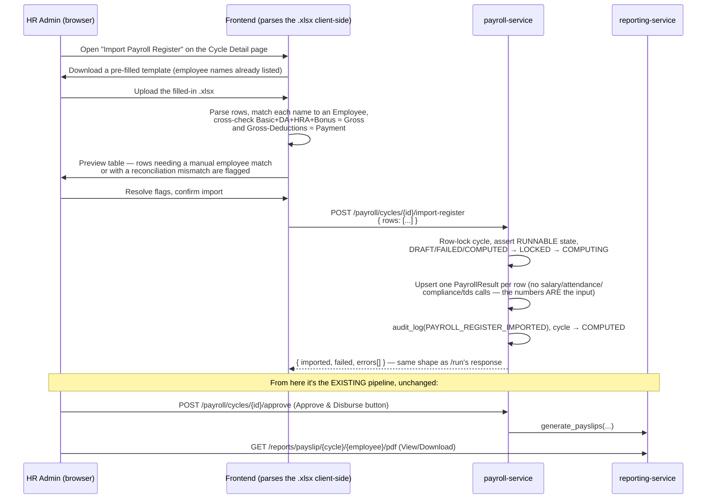

# Feature Plan: Excel Payroll Register Import → Direct Payslip Generation

> How to let someone fill in a pre-computed payroll register (like the Huntsman Solutions-style Excel
> sheet — Basic/DA/HRA/Bonus/Gross, ESIC/PF/PT/Total Deductions, Payment) and have the system generate
> payslips straight from those numbers, from a new control on the Payroll Cycle page. This is a design
> document — it explains what to build, where, and why, referencing the exact files involved, so it
> can be implemented directly.

## Table of Contents

1. [The Problem, in One Paragraph](#1-the-problem-in-one-paragraph)
2. [Why This Is Simpler Than It Looks](#2-why-this-is-simpler-than-it-looks)
3. [Column Mapping — Excel → System](#3-column-mapping--excel--system)
4. [End-to-End Flow](#4-end-to-end-flow)
5. [Backend Changes](#5-backend-changes)
6. [Frontend Changes](#6-frontend-changes)
7. [Employee Matching Strategy](#7-employee-matching-strategy)
8. [Validation & Edge Cases](#8-validation--edge-cases)
9. [Testing Plan](#9-testing-plan)
10. [Rollout Notes](#10-rollout-notes)
11. [Future Enhancements](#11-future-enhancements)

---

## 1. The Problem, in One Paragraph

The system's built-in payroll engine (`payroll-service`'s `orchestrator.py`) computes every number
itself — it calls salary-service for the CTC breakdown, attendance-service for LOP days,
compliance-service for PF/ESI/PT, and tds-service for TDS, then derives net pay
(see [TECHNICAL_OVERVIEW.md §11.3](TECHNICAL_OVERVIEW.md#113-running-a-payroll-cycle-the-flagship-workflow)).
But some clients already run their payroll math in Excel — the sheet in the screenshot has Basic, DA,
HRA, Bonus, Gross Wages, ESIC, PF, PT, Total Deductions, and Payment (net) **already calculated per
employee**. For those clients, re-deriving the same numbers through the automated engine is redundant
and error-prone (their Excel is the source of truth, not the app's compliance rules). What's needed is
a second, parallel way to get a payroll cycle to `COMPUTED` status: **import the numbers directly**
instead of computing them.

## 2. Why This Is Simpler Than It Looks

Two things about the existing system make this a genuinely small feature rather than a parallel
payroll engine:

1. **`PayrollResult.breakdown_json` is a free-form JSONB column**
   (`services/payroll-service/app/models.py`), not a rigid schema. The reporting-service's payslip
   renderer (`services/reporting-service/app/template.py::render_payslip_html`) reads whatever is in
   that JSON. So a payslip generated from an imported Excel row and a payslip generated from the
   automated engine go through **the exact same PDF rendering, caching, and bulk-ZIP-download code** —
   nothing in reporting-service needs to know or care where the numbers came from.
2. **The cycle state machine already has a "manually computed" shape.** `orchestrator.run_cycle`
   transitions `DRAFT → LOCKED → COMPUTING → COMPUTED` and writes one `PayrollResult` row per employee.
   The import feature does the identical transition and writes the identical row shape — it just skips
   the four outbound service calls and uses the numbers from the spreadsheet instead. Every downstream
   step (Approve & Disburse, payout batch creation, payslip generation, the audit log) is completely
   unaware of which path produced the `COMPUTED` cycle, because they all only ever look at
   `PayrollResult` rows, never at how they got there.

This means the feature is additive: **one new backend endpoint, one new frontend modal, and a small
addition to the payslip template** — nothing about the existing automated pipeline changes.

---

## 3. Column Mapping — Excel → System

| Excel column | Maps to | Notes |
|---|---|---|
| Sr | *(ignored)* | Row ordinal from the sheet, not stored |
| Name of Employee | Used only to **match** the row to an existing `Employee` record | See [§7](#7-employee-matching-strategy) — this is the one genuinely tricky part |
| Present Days | `breakdown.attendance.present_days` | New field on the attendance sub-object (currently holds `total_days`/`payable_days`/`lop_days`) |
| P.H (Paid Holiday) | `breakdown.attendance.holiday_days` | New field |
| Wo.ff (Weekly Off) | `breakdown.attendance.wo_days` | New field |
| Total Days | `breakdown.attendance.total_days` | Matches the existing field name |
| Basic | `breakdown.earnings.basic` | Matches an existing field name |
| DA | `breakdown.earnings.da` | **New earning key** — see the template change in [§5.3](#53-payslip-template-must-learn-two-new-line-items) |
| HRA | `breakdown.earnings.hra` | Matches an existing field name |
| Bonus | `breakdown.earnings.bonus` | **New earning key** — same template change |
| Gross Wages | `breakdown.earnings.gross`, and `PayrollResult.gross_earnings` | Matches existing fields |
| Esic 0.75% | `breakdown.deductions.employee_esi` | Reuses the existing key — no template change needed |
| PF 12% | `breakdown.deductions.employee_pf` | Reuses the existing key |
| PT | `breakdown.deductions.pt` | Reuses the existing key |
| Total Ded | `PayrollResult.total_deductions` | Also cross-checked against the sum of the individual deduction fields — see [§8](#8-validation--edge-cases) |
| Payment | `PayrollResult.net_pay`, and `breakdown.net_pay` | Matches existing fields |

Everything in the right-hand column already exists as a concept in the system **except** `DA` and
`Bonus` as named earning line items, and `present_days`/`holiday_days`/`wo_days` as named attendance
fields. Those are additive JSON keys — no database migration required (JSONB has no fixed shape) — but
two of them (DA, Bonus) need one small change described below so they actually show up on the rendered
PDF.

### 5.3 Payslip template must learn two new line items

This is the one non-obvious gotcha, worth flagging up front: `render_payslip_html` in
`services/reporting-service/app/template.py` does **not** dynamically render every key under
`breakdown["earnings"]`. It builds a hardcoded three-row dict:
```python
earning_rows = {
    "Basic": earnings.get("basic", "0"),
    "HRA": earnings.get("hra", "0"),
    "Special Allowance": earnings.get("special_allowance", "0"),
}
```
If an imported row's `earnings.da` and `earnings.bonus` are left out of this dict, they'd be silently
invisible on the PDF — the bold "Gross Earnings" total (taken directly from `earnings.gross`) would
still be *correct*, but the individual rows above it wouldn't add up to it, which is exactly the kind
of inconsistency you don't want on a document someone is being paid against. Fix: add two more entries
to `earning_rows` (`"DA": earnings.get("da", "0")` and `"Bonus": earnings.get("bonus", "0")`) — a
2-line change, and it's backward compatible, since `earnings.get("da", "0")` is `"0"` (and therefore
filtered out by the existing `earning_rows = {k: v for k, v in earning_rows.items() if float(v) > 0}`
line) for every payslip the automated engine still generates.

The `deduction_rows` dict already includes `"Provident Fund (PF)"`, `"ESI"`, and `"Professional Tax
(PT)"` keyed off `employee_pf`/`employee_esi`/`pt` — since the import reuses those exact key names, no
change is needed on the deductions side.

---

## 4. End-to-End Flow



---

## 5. Backend Changes

All in `services/payroll-service/app/`.

### 5.1 New endpoint

`POST /api/v1/payroll/cycles/{cycle_id}/import-register` in `routes.py`, guarded by the same
`_admin_only` role dependency `run_cycle` uses (`ORG_ADMIN`, `PAYROLL_ADMIN`, `SUPER_ADMIN`).

Request body (a new Pydantic schema, `ImportRegisterRequest`, in `schemas.py`):
```python
class ImportRegisterRow(BaseModel):
    employee_id: uuid.UUID
    present_days: Decimal | None = None
    holiday_days: Decimal | None = None
    wo_days: Decimal | None = None
    total_days: int
    basic: Decimal
    da: Decimal = Decimal("0")
    hra: Decimal
    bonus: Decimal = Decimal("0")
    gross: Decimal
    employee_esi: Decimal = Decimal("0")
    employee_pf: Decimal = Decimal("0")
    pt: Decimal = Decimal("0")
    total_deductions: Decimal
    net_pay: Decimal

class ImportRegisterRequest(BaseModel):
    rows: list[ImportRegisterRow]
```
Note the frontend sends **`employee_id`**, not the employee's name — all the fuzzy name-matching
happens client-side during preview (§7), so the backend only ever deals with a resolved UUID, exactly
like every other endpoint in the system. This keeps the backend simple and keeps "did this name match
correctly" a reviewable, correctable step for the human importing the file, not a silent server-side
guess.

### 5.2 A new orchestrator function, not a new state machine

Add `import_register(session, ctx, cycle, rows) -> dict` to `orchestrator.py`, structured as a sibling
to `run_cycle`, reusing everything except the outbound service calls:

```python
async def import_register(session, ctx, cycle, rows: list[ImportRegisterRow]) -> dict:
    # Same row-lock + transition guard as run_cycle — see state.py.
    locked = await session.scalar(select(PayrollCycle).where(PayrollCycle.id == cycle.id).with_for_update())
    if locked is not None:
        cycle = locked
    state.assert_transition(cycle.status, state.LOCKED)
    cycle.status = state.LOCKED
    state.assert_transition(cycle.status, state.COMPUTING)
    cycle.status = state.COMPUTING
    await session.commit()

    imported, failed, errors = 0, 0, []
    for row in rows:
        try:
            emp = await client.get_employee(...)  # tenant/client-scoped lookup, reuse client.py
            breakdown = _build_breakdown_from_row(row, emp)  # earnings/deductions/attendance dict, per §3
            await _upsert_result(session, ctx.tenant_id, cycle.id, row.employee_id,
                                  gross=row.gross, total_deductions=row.total_deductions,
                                  net_pay=row.net_pay, breakdown=breakdown, status="COMPUTED")
            imported += 1
        except Exception as exc:
            failed += 1
            errors.append(f"{row.employee_id}: {exc}")
        await session.commit()

    cycle.status = state.COMPUTED if imported > 0 or failed == 0 else state.FAILED
    await audit_log(session, tenant_id=ctx.tenant_id, event_type="PAYROLL_REGISTER_IMPORTED",
                     entity_type="payroll_cycle", entity_id=str(cycle.id),
                     payload={"cycle_id": str(cycle.id), "row_count": len(rows), "source": "excel_import"},
                     actor_id=ctx.user_id)
    await session.commit()
    return {"cycle_id": cycle.id, "status": cycle.status, "imported": imported, "failed": failed, "errors": errors}
```

This deliberately **reuses** `_upsert_result` (already upserts by `(tenant_id, cycle_id, employee_id)`,
so re-importing a corrected file is idempotent) and the exact same state-machine guard
(`state.assert_transition`, row-locked `SELECT ... FOR UPDATE`) that makes `run_cycle` safe against a
double-click — no new concurrency logic to write or reason about.

### 5.3 Payslip template

Covered above in [§3](#3-column-mapping--excel--system) — the two-line addition to `earning_rows` in
`services/reporting-service/app/template.py`.

### 5.4 Frontend API client

`frontend/src/api/payroll.ts` gets one new method:
```typescript
importRegister: (cycleId: string, rows: ImportRegisterRow[]) =>
  api.post<RunSummary>(`/payroll/cycles/${cycleId}/import-register`, { rows }).then((r) => r.data),
```
Reuses the existing `RunSummary` type for the response (same `{computed, failed, total_employees,
errors}` shape `runMut.data` already renders in `CycleDetail.tsx`'s "Run complete" panel — see
[§6.2](#62-wiring-into-the-existing-run-complete-panel)) — no new response type needed on the frontend
either.

---

## 6. Frontend Changes

### 6.1 New component: `ExcelRegisterImportModal.tsx`

Model this directly on `frontend/src/components/BulkImportModal.tsx`, which already solves every UI
problem this feature has (Excel parsing with the `xlsx` package, a 4-step wizard, a preview table with
per-row validation flags). Reuse its exact step pattern:

| Step | What happens |
|---|---|
| **1. Download Template** | Generate an `.xlsx` via `XLSX.utils.aoa_to_sheet` (same approach as `Attendance.tsx::downloadTemplate`), columns exactly matching the screenshot (Sr, Name of Employee, Present Days, P.H, Wo.ff, Total Days, Basic, DA, HRA, Bonus, Gross Wages, Esic 0.75%, PF 12%, PT, Total Ded, Payment), **pre-filled with the cycle's client's employee names** in column order so whoever fills it in doesn't have to type names — only the numeric cells. |
| **2. Upload File** | File picker / drag-drop, parsed with `XLSX.utils.sheet_to_json`, identical to `BulkImportModal`'s `parseFile()`. |
| **3. Preview & Validate** | A table with one row per parsed line, each carrying `_rowNum`, `_isValid`, `_errors` (same shape as `BulkImportModal`'s `ParsedRow`). Per row: the matched employee (or a searchable dropdown to resolve an ambiguous/failed match — see §7), and a reconciliation check (`Basic+DA+HRA+Bonus` vs the sheet's own `Gross Wages`, and `Gross - Total Ded` vs `Payment`) with mismatches highlighted the same way `BulkImportModal` highlights row errors (`bg-red-50/30 dark:bg-red-900/5`). |
| **4. Import Results** | Calls `payrollApi.importRegister(cycleId, validRows)`, shows a per-row result table on completion — same visual pattern as `BulkImportModal`'s step 4. |

### 6.2 Wiring into the existing "Run complete" panel

In `CycleDetail.tsx`, add the trigger button next to "Run Payroll" in the Actions card
([CycleDetail.tsx:214-231](frontend/src/pages/CycleDetail.tsx#L214-L231)), enabled under the identical
`canRun` condition (`DRAFT`, `COMPUTED`, or `FAILED`):

```tsx
<button className="btn-ghost" disabled={!canRun} onClick={() => setShowImportModal(true)}>
  <FileSpreadsheet className="h-4 w-4" />
  Import Excel Register
</button>
```

On success, invalidate the same queries `approveMut`/`runMut` already invalidate
(`qk.cycle(cycleId)`, `qk.cycleSummary(cycleId)`) so the page immediately reflects the new `COMPUTED`
status and result count — the existing "Run complete" summary panel
([CycleDetail.tsx:295-316](frontend/src/pages/CycleDetail.tsx#L295-L316)) can be reused verbatim for
the import result too, since the response shape is identical.

This gives the user exactly what was asked for: **on the Payroll Cycle page, a second way to reach
"computed," alongside "Run Payroll."** Everything after that point — Review Summary, Approve &
Disburse, Download ZIP, individual payslip view — is already wired to work off `PayrollResult` rows and
needs zero changes.

---

## 7. Employee Matching Strategy

This is the one part of the feature that's a genuine design decision, because the source Excel only
has a free-text name column — no employee code, no UUID.

**Matching algorithm (client-side, during the Preview step):**
1. Normalize both sides: lowercase, trim, collapse internal whitespace.
2. Exact normalized match against the cycle's client's active employees (`first_name + " " +
   last_name`) → auto-matched, shown with a ✓.
3. No exact match → try a fuzzy match (e.g. Levenshtein distance ≤ 2, or a simple token-overlap score)
   and surface it as a **suggestion**, not an auto-match — still requires the user to confirm it in the
   preview table, never silently accepted.
4. No confident match at all → row is flagged invalid and blocked from import until the user manually
   picks the right employee from a searchable dropdown (reuse the employee-search pattern already built
   for `EmployeeModal`'s reporting-manager picker, or `Salary.tsx`'s employee selector).

**Why not match server-side or trust it automatically:** paying the wrong person is a much worse
failure mode than an extra confirmation click. Keeping the match-and-confirm step in the UI, and only
ever sending a resolved `employee_id` to the backend (§5.1), means a name collision or typo can never
silently misroute someone's pay — the backend's contract is "you already told me exactly who this row
is for," which is the same contract every other write endpoint in the system already has.

---

## 8. Validation & Edge Cases

| Case | Handling |
|---|---|
| Employee name doesn't match anyone | Blocked in preview, requires manual selection (§7) |
| Same employee appears twice in the sheet | Flagged as an error in preview — `_upsert_result`'s upsert semantics mean the second row would silently overwrite the first, so this should be caught and shown to the user rather than resolved silently |
| `Basic + DA + HRA + Bonus` doesn't add up to `Gross Wages` (beyond a small rounding tolerance, e.g. ₹1) | Flagged as a warning in preview, not a hard block — the sheet's `Gross Wages` value is still what's stored (it's the authoritative pre-computed figure), but the mismatch is surfaced so a typo in one cell doesn't go unnoticed |
| `Gross Wages − Total Ded` doesn't equal `Payment` | Same treatment — warning, not a block |
| An employee row belongs to a different client than the cycle | Backend rejects with 400 — `client.get_employee` (§5.2) is tenant/client-scoped exactly like every other cross-service lookup in `orchestrator.py` |
| Cycle is `DISBURSED` or `APPROVED` | Blocked — `state.assert_transition` already rejects any transition out of those states (see `services/payroll-service/app/state.py`); the button in the UI is disabled by the same `canRun` check `run_cycle` uses |
| Re-importing a corrected file for the same cycle | Works cleanly — `_upsert_result` upserts by `(tenant_id, cycle_id, employee_id)`, so a second import just overwrites the rows that changed |
| Blank/zero cells (e.g. `DA` not used by this client) | Treated as `0`, not an error — matches how `earning_rows`/`deduction_rows` already filter out zero-value rows on the rendered payslip |
| Numbers pasted from Excel with currency formatting (`₹`, commas) | Frontend parsing strips non-numeric characters before validation, same as any numeric input elsewhere in the app |

---

## 9. Testing Plan

1. **Unit test** `orchestrator.import_register` (mirrors the existing test coverage pattern for
   `run_cycle`/`approve_cycle`): a cycle in `DRAFT` with 3 rows → asserts `COMPUTED`, 3 `PayrollResult`
   rows, correct `breakdown_json` shape, one audit log entry.
2. **Unit test** the state-guard: attempt `import_register` on a `DISBURSED` cycle → expect the same
   409 `run_cycle` would give.
3. **Unit test** `template.py`'s `render_payslip_html` with a breakdown containing `da`/`bonus` keys →
   assert both rows appear and the earnings column sums to the bold "Gross Earnings" total.
4. **Manual end-to-end**: download the template from a real cycle, fill in the numbers from the sample
   sheet in the screenshot, upload, confirm the preview reconciliation checks pass, import, then
   Approve & Disburse and download a payslip PDF — confirm DA/Bonus/ESIC/PF/PT all appear correctly.
5. **Manual edge case**: intentionally misspell one employee name and duplicate another row — confirm
   the preview step catches both before allowing import.

---

## 10. Rollout Notes

- **No database migration required.** `breakdown_json` is JSONB; the new `da`/`bonus`/attendance keys
  are just new dict entries, not new columns.
- **Fully backward compatible.** Cycles computed by the existing automated engine are completely
  unaffected — the `template.py` change only adds two rows that render as empty/hidden when their
  values are `0`, which is true for every payslip the engine has ever produced.
- **No changes to reporting-service's caching, bulk-ZIP download, or blob storage** — an
  imported-register payslip is cached and downloaded through the exact same code path documented in
  [TECHNICAL_OVERVIEW.md §11.4](TECHNICAL_OVERVIEW.md#114-payslips-on-demand-rendering-with-caching).
- **Role/permission model unchanged** — reuses the existing `_admin_only` guard already protecting
  `/payroll/cycles/{id}/run`.

---

## 11. Future Enhancements

Not required for the initial version, but worth keeping in mind if this feature gets used heavily:

- **Optional `Employee Code` column** in the template — if present, match by code first (exact,
  unambiguous) and fall back to name-matching only for rows where it's blank, removing most of the
  §7 fuzziness for clients willing to add one column to their existing sheet.
- **Store the uploaded file itself** via `blobstore-service` (already the platform's file-storage
  layer — see [TECHNICAL_OVERVIEW.md §5](TECHNICAL_OVERVIEW.md#5-the-services)) as a linked audit
  attachment on the `PAYROLL_REGISTER_IMPORTED` event, so "what exact spreadsheet produced this
  payroll run" is always retrievable later, not just the parsed numbers.
- **A reconciliation mode**: run the automated engine *and* the import side by side for a cycle,
  surfacing a diff instead of one silently overriding the other — useful once there's enough trust in
  the automated engine to use the Excel import as a second opinion rather than the primary source.
