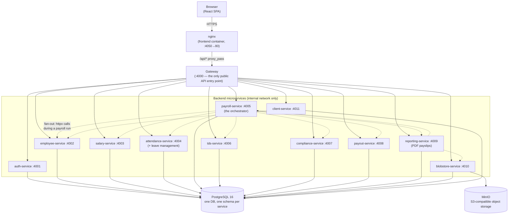
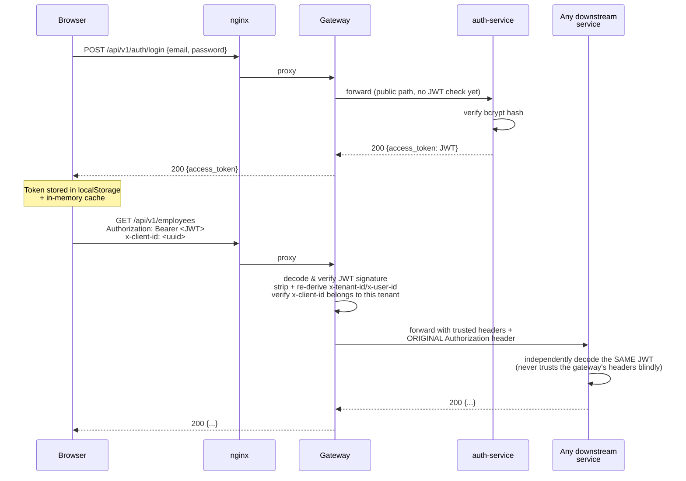
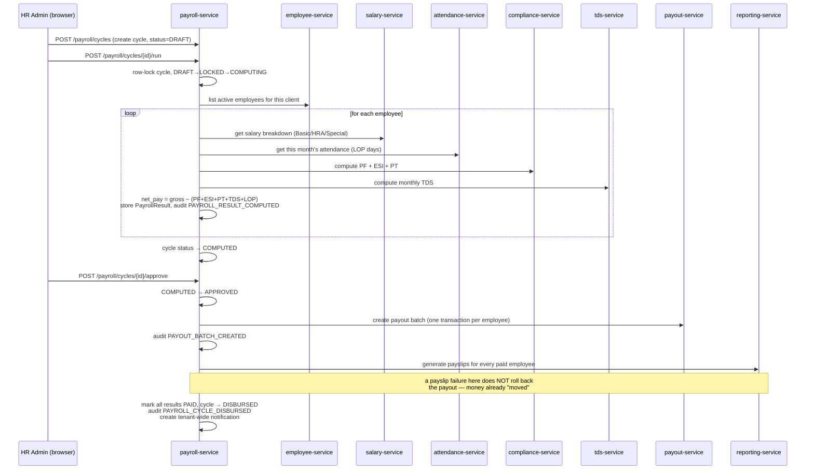

# PeopleOS — Technical Overview

> A plain-English but technically precise guide to what this system is, how it's built, and how its
> pieces talk to each other. Written so anyone on the team can use it to explain the project to a new
> engineer, a client's tech team, or an auditor without re-deriving the architecture from the code
> each time.

## Table of Contents

1. [What This Product Does](#1-what-this-product-does)
2. [Architecture at a Glance](#2-architecture-at-a-glance)
3. [Technology Stack](#3-technology-stack)
4. [Repository Layout](#4-repository-layout)
5. [The Services](#5-the-services)
6. [The Shared Library (`hr_shared`)](#6-the-shared-library-hr_shared)
7. [How Services Talk to Each Other](#7-how-services-talk-to-each-other)
8. [Multi-Tenancy & Client Scoping](#8-multi-tenancy--client-scoping)
9. [Authentication & Authorization](#9-authentication--authorization)
10. [Security & Compliance Measures](#10-security--compliance-measures)
11. [Core Workflows, Step by Step](#11-core-workflows-step-by-step)
12. [Frontend Architecture](#12-frontend-architecture)
13. [Running It Locally](#13-running-it-locally)
14. [Domain Glossary](#14-domain-glossary)
15. [Known Limitations & Roadmap](#15-known-limitations--roadmap)

---

## 1. What This Product Does

**PeopleOS** is a multi-tenant HR & Payroll SaaS for Indian payroll compliance. A single deployment
serves many **tenants** (payroll outsourcing firms / HR agencies), and each tenant manages many
**client companies**, and each client company has its own **employees**.

For every client company, the system:

- Tracks employee records, departments, and work locations.
- Defines each employee's salary structure (CTC → Basic / HRA / Special Allowance).
- Records monthly attendance and leave.
- Runs a **monthly payroll cycle** that computes gross pay, statutory deductions (PF, ESI,
  Professional Tax, TDS), and net pay for every employee.
- Simulates disbursing that net pay ("payouts") and generates PDF payslips.
- Computes and tracks statutory liabilities (PF/ESI/PT/TDS) for compliance filing.
- Stores client documents and portal credentials (GST, PF, ESI portals) securely.
- Keeps an immutable audit trail of every payroll-relevant action.

In short: **employee data + attendance + salary rules → a payroll engine → compliance numbers,
payslips, and a paper trail.**

---

## 2. Architecture at a Glance

This is a **microservices** system: one small FastAPI service per business capability, all sitting
behind a single API **gateway**, all backed by one shared PostgreSQL instance (each service owns its
own schema), plus MinIO for file storage.



**The single most important rule in this system:** the gateway is the *only* service exposed to the
outside world. Every other service — including the database and MinIO — lives on the internal Docker
network and is unreachable from a browser. All authentication happens at two layers (gateway *and*
every downstream service independently — see [§9](#9-authentication--authorization)).

---

## 3. Technology Stack

| Layer | Technology | Notes |
|---|---|---|
| **Frontend framework** | React 18 + TypeScript, built with Vite | SPA, client-side routed |
| **Frontend data layer** | TanStack React Query | server-state cache, no Redux |
| **Frontend styling** | Tailwind CSS | utility-first, dark mode support |
| **Frontend charts** | Recharts | dashboard trend/donut charts |
| **Frontend animation** | Framer Motion | page transitions, modals |
| **Frontend HTTP** | Axios | one shared instance, `frontend/src/lib/api.ts` |
| **Frontend routing** | React Router v6 | `frontend/src/App.tsx` |
| **Backend framework** | FastAPI (Python 3.11), async throughout | one app per microservice |
| **Backend ORM** | SQLAlchemy 2.0 (async) + `asyncpg` driver | `Mapped[...]` typed models |
| **Backend validation** | Pydantic v2 (+ `pydantic-settings`) | request/response schemas & env config |
| **Auth** | `python-jose` (JWT, HS256) + `passlib`/`bcrypt` | shared-secret JWT across all services |
| **Database** | PostgreSQL 16 | one instance, one schema per service |
| **Object storage** | MinIO (S3-compatible) | file uploads, payslip PDFs, client documents |
| **PDF generation** | WeasyPrint | HTML → PDF for payslips (reporting-service only) |
| **Inter-service HTTP** | `httpx` (async) | every service-to-service call |
| **Reverse proxy / edge** | nginx (frontend image) + a hand-written FastAPI gateway | see [§7](#7-how-services-talk-to-each-other) |
| **Containerisation** | Docker + Docker Compose | one `Dockerfile.service` template for every Python service |
| **Field-level encryption** | `cryptography` (Fernet / `MultiFernet`) | PAN, Aadhaar, bank accounts, portal passwords |
| **Optional messaging** | Kafka (`aiokafka`) | blobstore-service only, for storage event notifications — optional, off by default |
| **Optional virus scanning** | ClamAV (`clamd`) | blobstore-service, for uploaded files |
| **Scheduling** | APScheduler | blobstore-service, for purging soft-deleted blobs |
| **Rate limiting** | `slowapi` | blobstore-service |

---

## 4. Repository Layout

```
hr_payroll-develop/
├── docker-compose.yml         # defines & wires every service, Postgres, MinIO
├── Dockerfile.service          # ONE generic Dockerfile used by all 11 Python services
├── .env / .env.example         # secrets: JWT_SECRET, FIELD_ENCRYPTION_KEY, MinIO creds
├── shared/hr_shared/           # the shared Python library every service installs (see §6)
├── services/
│   ├── gateway/                # the single public entry point (reverse proxy + auth gate)
│   ├── auth-service/           # users, tenants, login, JWT issuance
│   ├── employee-service/       # employees, departments, locations, financial years
│   ├── client-service/         # client companies, portal credentials, documents
│   ├── salary-service/         # salary structures & templates (CTC breakdown)
│   ├── attendance-service/     # monthly attendance + leave management
│   ├── payroll-service/        # the payroll ORCHESTRATOR — ties everything together
│   ├── compliance-service/     # PF / ESI / PT / LWF computation
│   ├── tds-service/            # income tax (TDS) computation & declarations
│   ├── payout-service/         # simulated bank disbursement batches
│   ├── reporting-service/      # payslip PDF rendering & bulk ZIP export
│   └── blobstore-service/      # file storage (MinIO-backed), the most complex service
├── frontend/                   # React + TypeScript SPA
│   └── src/
│       ├── pages/              # one file per screen (Dashboard, Employees, Cycles, ...)
│       ├── api/                # one file per backend domain, thin Axios wrappers
│       ├── layout/              # AppShell (sidebar/header), ProtectedRoute
│       ├── lib/                 # auth.ts, api.ts, ClientContext.tsx, roles.ts, format.ts
│       └── components/          # shared UI building blocks
└── scripts/                    # seed.py, init-db.sql, init-minio.sh, trigger_*.py (demo helpers)
```

---

## 5. The Services

Every backend service is a small FastAPI app that:
- Owns **one PostgreSQL schema** (`employee_schema`, `payroll_schema`, etc.) inside the single shared
  database.
- Independently verifies the caller's JWT (never trusts a header blindly).
- Is only reachable from the gateway or another service on the Docker-internal network — nothing but
  the gateway (`:4000`) and the frontend (`:4050`) is exposed to the host.

| Service | Port | Owns (data) | Depends on (calls) |
|---|---|---|---|
| **gateway** | 4000 (public) | nothing — stateless proxy | every other service |
| **auth-service** | 4001 | tenants, users, roles | — |
| **employee-service** | 4002 | employees, departments, locations, financial years, org workflow | — |
| **client-service** | 4011 | client companies, portal credentials, client documents | *shares* employee-service's DB schema |
| **salary-service** | 4003 | salary structures, salary templates | tds-service (notify on change) |
| **attendance-service** | 4004 | monthly attendance, leave policies/balances/requests | — |
| **payroll-service** | 4005 | payroll cycles, payroll results, notifications, audit log | employee, salary, attendance, tds, compliance, payout, reporting |
| **compliance-service** | 4007 | PF/ESI/PT/LWF contribution records & settings | — |
| **tds-service** | 4006 | TDS calculations, tax declarations, Form 16/12BA | — |
| **payout-service** | 4008 | payout batches & transactions (simulated bank transfer) | — |
| **reporting-service** | 4009 | generated report records, payslip PDFs | payroll-service, client-service, blobstore-service |
| **blobstore-service** | 4010 | blob metadata, document registry, employee documents | MinIO, (optional) Kafka |

### gateway
A single FastAPI app with **no database of its own**. It:
1. Validates every incoming JWT (except `/auth/login` and `/auth/register`).
2. Strips any client-supplied `x-tenant-id` / `x-user-id` / `x-client-id` header (these are
   attacker-controllable) and replaces them with values it derives itself from the *verified* token.
3. If a request carries `x-client-id`, confirms that client actually belongs to the caller's tenant
   (a `GET /clients/{id}` check against client-service, cached 60s) before forwarding it — so no user
   can address another tenant's client company by guessing a UUID.
4. Reverse-proxies the request to the matching backend based on a path-prefix table
   (`services/gateway/app/settings.py::ROUTES`), e.g. `/api/v1/employees/*` → employee-service.
5. Uses a long HTTP timeout (300s) because some requests (bulk payslip PDF rendering) are genuinely
   slow.

### auth-service
Owns tenants and users. `POST /auth/register` bootstraps a brand-new tenant plus its first admin user
(bootstrap roles: `ORG_ADMIN`, `HR_MANAGER`, `PAYROLL_ADMIN`). `POST /auth/login` verifies a bcrypt
password hash and issues a signed JWT. Passwords are hashed with bcrypt; the JWT itself carries
`user_id`, `tenant_id`, `roles`, and `email` — no separate session store, so **the JWT itself is the
session.**

### employee-service
The employee master. Employees, departments, work locations, financial years, and a small
approval-workflow engine (`workflow_definitions` / `workflow_instances`). Every employee record
carries PII (PAN, Aadhaar, bank account, UAN) which is **masked** in every list/detail response —
the raw value is only obtainable through an audited `POST /employees/{id}/pii-access` endpoint.

### client-service
The client-company master (the outsourcing firm's *customers*). Deliberately shares
employee-service's Postgres schema (`employee_schema`) because employees carry a `client_id`
foreign key into this table — keeping them in the same schema keeps that reference resolvable without
cross-schema joins. Also owns encrypted portal credentials (GST/PF/ESIC login) and client documents.

### salary-service
Defines each employee's **salary structure**: an annual CTC broken into Basic (40%), HRA (50% metro /
40% non-metro), and Special Allowance. Also supports reusable salary templates. When a structure
changes, it notifies tds-service so tax projections stay current.

### attendance-service
Two responsibilities bundled into one service: monthly attendance (present/absent/leave days per
employee, with a lock/validate workflow so payroll can only run against finalized data) and leave
management (policies, balances, and a leave-request approval workflow). A month can be `DRAFT` →
`VALIDATED` → `LOCKED`; only `LOCKED` attendance is considered payroll-authoritative.

### payroll-service — the orchestrator
The heart of the system. It doesn't compute salary, tax, or compliance numbers itself — it **calls
out to every other service** for each employee and assembles the results into one payroll record. See
[§11.3](#113-running-a-payroll-cycle-the-flagship-workflow) for the full walkthrough. It also owns the
`notifications` table and the append-only `audit_log` (via the shared library), and exposes the
platform's only Server-Sent-Events endpoint.

### compliance-service
Pure computation service for Indian statutory deductions: **PF** (Provident Fund, 12% employee + 12%
employer, ₹15,000 wage ceiling), **ESI** (Employee State Insurance, 0.75%/3.25%, ₹21,000 eligibility
ceiling), **PT** (Professional Tax, state-specific), and **LWF** (Labour Welfare Fund). Settings are
configurable per client per state. Recomputing a cycle deletes and re-inserts that employee's rows for
that cycle (idempotent re-run).

### tds-service
Income tax (TDS — Tax Deducted at Source) computation under both old and new regimes, investment
declarations, tax regime history, and statutory forms (Form 12BA, Form 16). Every computation is
stored with a `trace_hash`/`trace_json` so a specific number can be explained/audited later.

### payout-service
A **simulated** bank disbursement layer: groups net-pay amounts into a `PayoutBatch` of
`PayoutTransaction` rows, each with an idempotency key (so retrying a disbursement can never double-pay
someone) and an encrypted bank reference. There is no real bank/UPI integration in V1 — this models the
shape of one.

### reporting-service
Renders payslip PDFs from a payroll result using WeasyPrint (HTML → PDF), uploads them to
blobstore-service, and caches the resulting blob id so the same payslip isn't re-rendered on every
view. Also supports a **bulk ZIP download** of every payslip in a cycle (rendering in parallel,
bounded by a semaphore, since WeasyPrint is CPU-bound).

### blobstore-service
The most elaborate service in the platform — a small file-storage platform in its own right:
- Stores files in MinIO (S3-compatible), tracks metadata (`blobs` table) and a separate
  `document_registry` / `employee_documents` workflow (upload → verify/reject).
- **Soft-delete + scheduled purge**: `DELETE /blobs/{id}` just sets `deleted_at`; an APScheduler job
  permanently purges after a retention window.
- **Tenant isolation** is enforced via the `X-Tenant-Id` header, but only as defence-in-depth — it
  must match the tenant claim inside the caller's *own* verified JWT, never trusted on its own.
- Optional Kafka consumer/producer for storage event notifications, streamed to the frontend over SSE.
- Optional ClamAV virus scanning and `slowapi` rate limiting.
- Ships its own `AUDIT.md` documenting known issues and a migration plan — worth reading before
  making changes here.

---

## 6. The Shared Library (`hr_shared`)

Every service `pip install -e`s the same local package (`shared/hr_shared/`) so cross-cutting concerns
are implemented **once**, not copy-pasted eleven times:

| Module | Provides |
|---|---|
| `base.py` | `TenantAwareBase` — the SQLAlchemy declarative base every table inherits, giving every table a UUID `id`, a required `tenant_id`, and `created_at`/`updated_at` for free. |
| `auth.py` | `RequestContext` (decoded identity), `build_context_dependency()` (the FastAPI dependency every protected route uses), `create_access_token()` / `decode_token()`. |
| `audit.py` | `AuditLog` model + `audit_log()` helper — one shared, append-only, tenant-scoped audit table (currently written only by payroll-service). |
| `crypto.py` | `EncryptedString` (a SQLAlchemy column type that transparently Fernet-encrypts on write / decrypts on read) and the `mask_pan` / `mask_bank_account` / `mask_aadhaar` / `mask_uan` display-masking helpers. |
| `money.py` | `Money` / `money()` — consistent Decimal-based currency handling so payroll math never drifts into float rounding errors. |
| `service.py` | `ServiceRuntime` — bundles a service's DB engine, session factory, `get_context` dependency, `require_roles()` guard, and its FastAPI `lifespan` (which auto-creates its schema/tables on startup via `metadata.create_all`, so `docker compose up` is a single working command with no separate migration step). |
| `config.py` | `BaseServiceSettings` — the common Pydantic settings base (DB URL, JWT secret, schema name, etc.) every service's `settings.py` extends. |
| `db.py` | Async engine/session-factory construction, schema-aware (`search_path`). |

**Why this matters when explaining the system:** a new service is built by writing its own
`models.py` / `routes.py` / `schemas.py` and reusing everything above — auth, tenant isolation,
encryption, and audit logging are not decisions a new service author has to make.

---

## 7. How Services Talk to Each Other

**Everything is synchronous HTTP (REST over JSON), via `httpx`.** There is no message bus /
event-driven backbone for business logic in V1 (Kafka exists only inside blobstore-service, and only
for storage-event notifications, off by default). This is a deliberate V1 simplicity trade-off, noted
in the code as a `TODO(v2)` in several places (e.g. the audit log doc-comment: *"emit to an event bus
instead of a direct insert"*).

Two distinct communication patterns exist:

**1. Browser → Gateway → Service** (north-south traffic)
The frontend only ever talks to `/api/v1/...` on its own origin. nginx proxies that to the gateway;
the gateway proxies it onward based on path prefix. The browser never talks to any backend service
directly, and never talks to Postgres or MinIO directly either.

**2. Service → Service** (east-west traffic, backend-only)
When payroll-service needs an employee's salary breakdown, it makes its own `httpx` call directly to
salary-service on the internal Docker network (`http://salary-service:4003/...`) — it does **not**
round-trip through the gateway. Each such call carries the *same* bearer token the original caller
supplied plus (when relevant) an `x-client-id` header, so the downstream service can independently
re-verify identity. `services/payroll-service/app/client.py` centralises every one of these outbound
calls.

**Real-time updates:** `GET /api/v1/events/stream` on payroll-service is a Server-Sent-Events
endpoint the frontend subscribes to (`useAuth`'s live-status dot in the header). **As of V1 this is a
15-second heartbeat stub** (`event: ping`) — it establishes the SSE connection and proves liveness, but
does not yet push real payroll events. blobstore-service has a separate, more complete SSE stream
backed by Kafka for storage events specifically.

---

## 8. Multi-Tenancy & Client Scoping

There are **two levels of scoping**, and it's important not to conflate them:

- **Tenant** — the outsourcing firm / HR agency using the SaaS. Every table has a `tenant_id`
  column, and every query is filtered by it. Tenant isolation is enforced by decoding it out of the
  JWT independently in every service — never taken on faith from a header.
- **Client** — one of *that tenant's* customer companies (e.g. "Nibe Limited", "Tanmay"). Many
  endpoints additionally require an `x-client-id` header (see `build_client_context_dependency` in
  `hr_shared/auth.py`) so that, e.g., listing payroll cycles for one client doesn't leak another
  client's cycles even within the same tenant.

**Database layout:** one PostgreSQL 16 instance, one **schema per service** —
`employee_schema`, `payroll_schema`, `salary_schema`, `attendance_schema`, `compliance_schema`,
`tds_schema`, `payout_schema`, `reporting_schema`, `audit_schema`, `notification_schema`. There is
deliberately no cross-schema foreign key between services (e.g. `payroll_results.employee_id` is just
a UUID column, not an FK to employee-service's table) — services stay independently deployable at the
cost of the database not being able to enforce that referential integrity itself.

---

## 9. Authentication & Authorization



**Why re-verify twice?** Zero-trust between services: even though the gateway already checked the
token, a compromised or misconfigured downstream service must not be able to skip auth just because a
request arrived on the internal network. Every service decodes the *original* JWT itself.

**The JWT payload** (`shared/hr_shared/auth.py::create_access_token`) carries:

```json
{
  "sub": "<user_id>",
  "tenant_id": "<tenant_id>",
  "roles": ["ORG_ADMIN", "HR_MANAGER", "PAYROLL_ADMIN"],
  "email": "admin@demo.com",
  "iat": 1784524645,
  "exp": 1784531845
}
```

There is no server-side session table — possessing a valid, unexpired JWT *is* being logged in.
Tokens expire after `ACCESS_TOKEN_MINUTES` (120 by default) and there is no refresh-token flow in V1;
the frontend simply redirects to `/login` on a 401.

### Roles

| Role | Typical holder | Notes |
|---|---|---|
| `SUPER_ADMIN` | platform operator | full access |
| `ORG_ADMIN` | tenant admin | full access within their tenant |
| `PAYROLL_ADMIN` | payroll admin | can approve cycles, view audit log |
| `HR_MANAGER` | HR staff | most HR + payroll screens, **cannot** view the audit log or approve cycles |
| `EMPLOYEE` | individual employee | self-service only (own payslip, own leave) |
| `CLIENT_ADMIN` / `CLIENT_MANAGER` | client-company contact | reserved for future client-portal access |
| `COMPLIANCE_OFFICER` | compliance staff | reserved role |

Role checks happen **twice, for different reasons**: the frontend (`frontend/src/lib/roles.ts`) hides
nav items and buttons a role shouldn't see (a UX convenience — "don't show a button that will just
403"), while every backend route independently enforces the same rule via
`ServiceRuntime.require_roles(...)`. The frontend check is never the actual security boundary.

---

## 10. Security & Compliance Measures

The system is built around **India's Digital Personal Data Protection (DPDP) Act, 2023**, which
explicitly classifies PAN, Aadhaar, and financial account numbers as sensitive personal data. That
shows up in the code as a consistent set of patterns:

- **Encryption at rest.** Any column holding PAN, Aadhaar, bank account numbers, portal passwords, or
  bank references uses `EncryptedString` (`shared/hr_shared/crypto.py`) — a SQLAlchemy column type
  that transparently Fernet-encrypts on write and decrypts on read. The encryption key
  (`FIELD_ENCRYPTION_KEY`) supports comma-separated multiple keys (`MultiFernet`) so it can be rotated
  without a "decrypt everything, re-encrypt everything" migration — the newest key encrypts, all keys
  can still decrypt.
- **Masking in day-to-day responses.** Even where the true value is needed for payroll computation,
  API responses mask it by default: `ABCDE1234F` → `ABCDE####F`, a bank account shows only its last 4
  digits, Aadhaar shows only its last 4 digits. The unmasked value is only obtainable through a
  dedicated, **audited** endpoint (`POST /employees/{id}/pii-access`) — every access is logged with
  who, when, and which fields.
- **Append-only audit log.** `shared/hr_shared/audit.py` provides one shared `audit_logs` table
  (currently written by payroll-service) that records every payroll-significant action —
  cycle runs, approvals, disbursements, PII access — as an immutable row with a SHA-256 hash of its
  payload (tamper-evidence, not tamper-*proof*: see [§15](#15-known-limitations--roadmap)).
- **Defence-in-depth tenant checks.** Described in [§8](#8-multi-tenancy--client-scoping) — every
  service re-derives `tenant_id` from its own JWT decode, never from a header alone.
- **Least-privilege object storage credentials.** The application containers never receive MinIO's
  root credentials — `minio-init` provisions a scoped IAM user (`blobstore-svc`) at startup with a
  least-privilege policy, and only that scoped user's keys are injected into blobstore-service.
- **No direct browser-to-storage access.** Blob downloads stream through the gateway
  (`/api/v1/blobs/{id}`) rather than handing the browser a presigned MinIO URL — MinIO has no
  host-exposed port at all, so it is architecturally unreachable from outside the Docker network.

---

## 11. Core Workflows, Step by Step

### 11.1 Registering a tenant & logging in

1. `POST /auth/register` creates a `Tenant` row and its first `User`, and grants that user
   `ORG_ADMIN` + `HR_MANAGER` + `PAYROLL_ADMIN` (the "bootstrap admin"). Returns a JWT immediately —
   no separate login step needed after registering.
2. Subsequent users are created by an existing admin via `POST /auth/users`.
3. `POST /auth/login` looks the user up by `(tenant_id?, email)`. If no `tenant_id` is supplied and the
   email is ambiguous across tenants, login is rejected — this stops an email that happens to exist in
   two tenants from silently authenticating against the wrong one.

### 11.2 Setting up a client & its employees

1. `POST /clients` (client-service) creates the client company — code, address, statutory IDs
   (GST/PAN/TAN/PF/ESIC codes), and optionally encrypted portal credentials.
2. `POST /employees` (employee-service) creates an employee against that `client_id`, with mandatory
   Aadhaar and optional PAN/bank details (validated client-side and re-validated server-side).
3. `POST /salary/structures` (salary-service) sets the employee's CTC; the service computes the
   Basic/HRA/Special split.
4. Attendance is entered monthly (manually, via a spreadsheet-like grid, or Excel bulk-import) in
   attendance-service, then **validated** and **locked** before payroll can run against it.

### 11.3 Running a payroll cycle (the flagship workflow)

This is the one workflow worth understanding in full, because it's where every other service meets.



**The state machine** (`services/payroll-service/app/state.py`) is strict and one-directional:

```
DRAFT → LOCKED → COMPUTING → COMPUTED → APPROVED → DISBURSED
                      ↓
                    FAILED  (re-runnable: FAILED → LOCKED)
```
`DISBURSED` can never be reopened. A `COMPUTED` cycle can be re-run (goes back through `LOCKED`),
which is how a correction to attendance or salary gets reflected before approval. The transition
guard is enforced with `SELECT ... FOR UPDATE` (a real row lock on Postgres) specifically so two
concurrent "Run" clicks can't both pass the DRAFT check and double-process the same cycle.

**Per-employee failure isolation:** if one employee's computation throws (missing salary structure,
service timeout, etc.), that employee's result is stored as `FAILED` with the error message, and the
loop continues — one bad employee record doesn't block payroll for the other 500.

**Net pay formula**, computed per employee inside `orchestrator.py::_compute_for_employee`:

```
monthly_gross  = Basic + HRA + Special Allowance          (from salary-service)
lop_deduction  = (monthly_gross / total_days) × LOP_days   (from attendance-service)
total_deductions = employee_PF + employee_ESI + PT + monthly_TDS + lop_deduction
net_pay        = monthly_gross − total_deductions
```

### 11.4 Payslips: on-demand rendering with caching

A payslip is **not** a stored artifact that only exists if disbursement succeeded — it's derived from
a `PayrollResult`, so it can be rendered the first time anyone asks for it, even for a cycle that was
only computed (not yet disbursed):

1. `GET /reports/payslip/{cycle_id}/{employee_id}/pdf` checks `generated_reports` for an existing
   `COMPLETED` row with a blob id.
2. If found, it fetches those bytes from blobstore-service and returns them — no re-render.
3. If not found (or the blob was purged), it fetches the `PayrollResult` + cycle + client info,
   renders HTML → PDF with WeasyPrint, uploads the PDF to blobstore-service, and records the blob id
   for next time.
4. **Bulk ZIP download** (`GET /reports/payslips/bulk/{cycle_id}`) does the same for every employee in
   the cycle concurrently (bounded to 4 at a time — WeasyPrint is CPU-bound), zips the results in
   memory, and streams the ZIP back. This endpoint requires `x-client-id` because every payroll lookup
   it fans out to is client-scoped.

### 11.5 File & document uploads

Any file (a client's GST certificate, an employee's ID proof) goes: browser → gateway →
blobstore-service → MinIO, with metadata recorded in Postgres (`blobs` / `document_registry` /
`employee_documents` tables). Delete is soft (sets `deleted_at`); a scheduled job purges the object
from MinIO permanently after a retention window.

---

## 12. Frontend Architecture

- **Routing**: `frontend/src/App.tsx` defines every page as a `<Route>`. Every route (except
  `/login`) is wrapped in `<ProtectedRoute>` (redirects to `/login` if unauthenticated) and
  `<ClientProvider>` (see below).
- **Server state**: React Query owns all data fetched from the API — no separate global store for
  server data. Each `frontend/src/api/*.ts` file is a thin, typed Axios wrapper for one backend
  domain (`employees.ts`, `payroll.ts`, `salary.ts`, ...); pages call these through `useQuery` /
  `useMutation` hooks directly.
- **The shared Axios instance** (`frontend/src/lib/api.ts`) attaches the bearer token and the
  currently-selected client's `x-client-id` header to every outgoing request automatically, and
  redirects to `/login` on any `401`.
- **`ClientContext`** (`frontend/src/lib/ClientContext.tsx`) holds the single globally-selected
  client company (the "Active Client Account" picker in the header) in React context + localStorage.
  Switching clients drops every cached query (except the `me` auth query) so stale data from the
  previous client is never shown while the new client's data loads.
- **Auth** (`frontend/src/lib/auth.ts`): the JWT is kept in both `localStorage`/`sessionStorage`
  *and* an in-memory variable (so a read doesn't hit storage on every request), with `useAuth()`
  exposing `login()`, `logout()`, and the decoded `user` (fetched once via `GET /auth/me` and cached
  with `staleTime: Infinity`).
- **Roles** (`frontend/src/lib/roles.ts`): a UI-only convenience layer (`hasRole`, `canApprove`,
  `isEmployeeOnly`, ...) — it hides buttons/nav a role can't use, but every backend route enforces
  the same rule independently, so this is never the real security boundary.
- **No SSR** — this is a pure client-side SPA, built by Vite and served as static files by nginx,
  which also reverse-proxies `/api/*` to the gateway so the built bundle is never hard-coded to a
  specific host.

---

## 13. Running It Locally

```bash
cp .env.example .env
# then fill in JWT_SECRET, FIELD_ENCRYPTION_KEY, and the MinIO credentials
# (the file tells you the exact one-liners to generate each one)

docker compose up -d --build
```

That single command builds and starts: Postgres, MinIO (+ a one-shot `minio-init` job that
provisions a least-privilege IAM user), all 11 Python services, the gateway, and the frontend. Each
Python service auto-creates its own database schema and tables on startup (`ServiceRuntime.create_all`
in `hr_shared/service.py`) — there's no separate migration step to run in V1.

| What | URL |
|---|---|
| The app | http://localhost:4050 |
| The API (if you want to hit it directly) | http://localhost:4000/api/v1/... |
| Gateway health check | http://localhost:4000/health |

`scripts/seed.py` populates demo data (a tenant, an admin user, clients, employees) by calling the
gateway from the host — see the script for the exact demo credentials it creates.

To rebuild just one service after a code change (faster than rebuilding everything):
```bash
docker compose build <service-name> && docker compose up -d <service-name>
```

---

## 14. Domain Glossary

For explaining this to someone without a payroll background:

| Term | Meaning |
|---|---|
| **CTC** | Cost to Company — an employee's total annual compensation package. |
| **Basic** | The base component of salary (here, a fixed 40% of monthly gross); most statutory calculations (PF, gratuity) are based on Basic, not gross. |
| **HRA** | House Rent Allowance — 50% of Basic in metro cities, 40% elsewhere in this system. |
| **Gross (pay)** | Total earnings before any deductions (Basic + HRA + Special Allowance). |
| **Net pay** | What actually lands in the employee's bank account: Gross minus all deductions. |
| **PF** | Provident Fund — a mandatory retirement savings scheme; both employee and employer contribute 12% of (capped) wages. |
| **EPS** | Employee Pension Scheme — a sub-component of the employer's PF contribution. |
| **ESI** | Employee State Insurance — mandatory health/social insurance for lower-wage employees (wages ≤ ₹21,000/month), 0.75% employee + 3.25% employer. |
| **PT** | Professional Tax — a small, state-specific tax on employment/professions. |
| **LWF** | Labour Welfare Fund — another small state-specific statutory contribution. |
| **TDS** | Tax Deducted at Source — income tax withheld from salary every month by the employer, under either the "old" or "new" tax regime. |
| **LOP** | Loss of Pay — days an employee is absent without approved leave; deducted pro-rata from gross pay. |
| **Payable days** | Days in the month the employee is actually entitled to be paid for (total days minus LOP). |
| **Payroll cycle** | One month's payroll run for one client company, moving through DRAFT → ... → DISBURSED. |
| **Payslip** | The PDF statement of an employee's earnings/deductions/net-pay for one cycle. |
| **Financial Year (FY)** | India's tax year, April–March (e.g. "2025-26"). |
| **Tenant** | A customer of this SaaS platform — the payroll/HR outsourcing firm itself. |
| **Client (company)** | One of a tenant's own customers — the actual employer whose employees are being paid. |
| **DPDP Act 2023** | India's Digital Personal Data Protection Act — the legal basis for this system's PII-encryption and audit requirements. |

---

## 15. Known Limitations & Roadmap

Pulled directly from `TODO(v2)` comments and doc-strings in the codebase — useful for setting
expectations honestly when explaining this system to someone evaluating it:

- **No event bus.** All inter-service communication is synchronous HTTP. A future version is expected
  to move the audit log (and possibly payroll events) onto a real event bus instead of a direct
  database insert.
- **SSE is a heartbeat stub.** `payroll-service`'s `/events/stream` currently only proves the
  connection is alive (a ping every 15s) — it does not yet push real payroll/cycle events to the
  frontend live.
- **No Alembic migrations yet.** Every service creates its tables with `metadata.create_all` at
  startup rather than a versioned migration chain — fine for a single-environment demo/V1, but it
  means schema changes aren't tracked or reversible the way a migration tool would give you.
- **Payout is simulated.** There's no real bank/UPI/NEFT integration — `payout-service` models the
  shape of a disbursement (batches, transactions, idempotency keys) without actually moving money.
- **Audit log is tamper-evident, not tamper-proof.** Each row is SHA-256 hashed, but the table isn't
  yet enforced append-only at the database level (e.g. via triggers/permissions) or partitioned/moved
  to cold storage.
- **Old-regime TDS with investment declarations is partially built.** The declaration data model
  exists in tds-service, but full old-regime computation using those declarations is marked as a V2
  item in the code.
- **blobstore-service has its own detailed audit** (`services/blobstore-service/AUDIT.md`) — read that
  file directly before making changes there; it documents specific known issues, risks, and a phased
  migration plan for that service.

