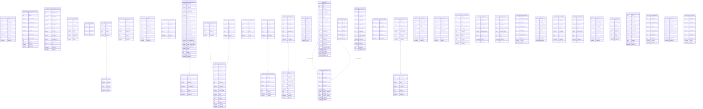

# Database Schemas & ER Diagram

```mermaid
erDiagram
  attendance_schema_attendance_audit {
    uuid client_id
    uuid actor_id
    uuid employee_id
    date month
    character event_type
    text previous_value
    text new_value
    text reason
    timestamp created_at
    uuid id
    uuid tenant_id
    timestamp updated_at
  }
  attendance_schema_attendance_months {
    uuid client_id
    date month
    character status
    integer total_employees
    integer employees_with_lop
    numeric completion_pct
    uuid validated_by
    timestamp validated_at
    uuid locked_by
    timestamp locked_at
    text locked_reason
    uuid unlocked_by
    timestamp unlocked_at
    text unlock_reason
    uuid id
    uuid tenant_id
    timestamp created_at
    timestamp updated_at
  }
  attendance_schema_attendance_records {
    uuid client_id
    uuid employee_id
    date month
    integer total_days
    numeric present_days
    numeric lop_days
    numeric payable_days
    boolean is_finalized
    numeric cl_days
    numeric sl_days
    numeric pl_days
    numeric wo_days
    numeric holiday_days
    numeric wfh_days
    numeric overtime_hours
    numeric attendance_pct
    text daily_status
    uuid id
    uuid tenant_id
    timestamp created_at
    timestamp updated_at
  }
  audit_schema_audit_logs {
    uuid client_id
    uuid id
    uuid tenant_id
    character event_type
    uuid actor_id
    character entity_type
    character entity_id
    jsonb payload_json
    character payload_hash
    uuid trace_id
    timestamp created_at
  }
  auth_schema_roles {
    uuid user_id
    character role_name
    uuid id
    uuid tenant_id
    timestamp created_at
    timestamp updated_at
  }
  auth_schema_tenants {
    character name
    boolean is_active
    uuid id
    uuid tenant_id
    timestamp created_at
    timestamp updated_at
  }
  auth_schema_users {
    character email
    character password_hash
    boolean is_active
    uuid id
    uuid tenant_id
    timestamp created_at
    timestamp updated_at
  }
  compliance_schema_esi_contributions {
    uuid client_id
    uuid employee_id
    uuid cycle_id
    numeric gross_wages
    boolean is_esi_eligible
    numeric employee_esi
    numeric employer_esi
    uuid id
    uuid tenant_id
    timestamp created_at
    timestamp updated_at
  }
  compliance_schema_pf_contributions {
    uuid client_id
    uuid employee_id
    uuid cycle_id
    numeric pf_wages
    numeric employee_pf
    numeric employer_eps
    numeric employer_epf
    boolean is_ceiling_applied
    uuid id
    uuid tenant_id
    timestamp created_at
    timestamp updated_at
  }
  compliance_schema_pt_deductions {
    uuid client_id
    uuid employee_id
    uuid cycle_id
    character state
    numeric pt_amount
    uuid id
    uuid tenant_id
    timestamp created_at
    timestamp updated_at
  }
  employee_schema_client_portal_credentials {
    uuid client_id
    character portal_type
    character portal_name
    character username
    text password_encrypted
    timestamp last_rotated_at
    uuid id
    uuid tenant_id
    timestamp created_at
    timestamp updated_at
  }
  employee_schema_clients {
    character client_code
    character client_name
    character legal_name
    character address_line1
    character address_line2
    character area
    character city
    character state
    character country
    character pincode
    character gst_number
    character pan_number
    character tan_number
    character cin_number
    character contact_person
    character contact_email
    character contact_mobile
    character contact_telephone
    character pf_establishment_code
    character esic_employer_code
    character professional_tax_number
    character labour_license_number
    character shop_act_number
    character status
    uuid id
    uuid tenant_id
    timestamp created_at
    timestamp updated_at
  }
  employee_schema_departments {
    uuid client_id
    character name
    character cost_center
    uuid id
    uuid tenant_id
    timestamp created_at
    timestamp updated_at
  }
  employee_schema_employees {
    character emp_code
    character first_name
    character last_name
    character email
    text pan_number
    text bank_account
    text bank_ifsc
    text uan_number
    character status
    date joining_date
    uuid department_id
    character designation
    uuid location_id
    character work_location
    character city
    character state
    character branch
    uuid client_id
    uuid id
    uuid tenant_id
    timestamp created_at
    timestamp updated_at
  }
  employee_schema_locations {
    uuid client_id
    character location_name
    character city
    character state
    character country
    uuid id
    uuid tenant_id
    timestamp created_at
    timestamp updated_at
  }
  notification_schema_notifications {
    uuid client_id
    uuid id
    uuid tenant_id
    uuid user_id
    character type
    text body
    text link
    boolean is_read
    timestamp created_at
  }
  payout_schema_payout_batches {
    uuid client_id
    uuid cycle_id
    character batch_type
    numeric total_amount
    character status
    uuid id
    uuid tenant_id
    timestamp created_at
    timestamp updated_at
  }
  payout_schema_payout_transactions {
    uuid client_id
    uuid batch_id
    uuid employee_id
    numeric amount
    character idempotency_key
    character status
    text bank_reference
    uuid id
    uuid tenant_id
    timestamp created_at
    timestamp updated_at
  }
  payroll_schema_payroll_cycles {
    uuid client_id
    character name
    date period_start
    date period_end
    character status
    boolean is_dry_run
    uuid created_by
    uuid approved_by
    uuid trace_id
    uuid id
    uuid tenant_id
    timestamp created_at
    timestamp updated_at
  }
  payroll_schema_payroll_results {
    uuid client_id
    uuid cycle_id
    uuid employee_id
    numeric gross_earnings
    numeric total_deductions
    numeric net_pay
    jsonb breakdown_json
    character status
    character error
    uuid id
    uuid tenant_id
    timestamp created_at
    timestamp updated_at
  }
  public_blob_outbox {
    uuid client_id
    uuid id
    character event_type
    uuid tenant_id
    uuid trace_id
    jsonb payload
    character payload_hash
    character status
    integer attempts
    text last_error
    timestamp created_at
    timestamp sent_at
  }
  public_blobs {
    uuid client_id
    uuid id
    uuid tenant_id
    uuid employee_id
    character bucket_name
    text object_key
    character folder
    text file_name
    character document_type
    character mime_type
    bigint size
    character etag
    character version
    character checksum
    uuid uploaded_by
    jsonb tags
    character doc_category
    character doc_label
    text description
    character verification_status
    uuid verified_by
    timestamp verified_at
    text verification_comment
    timestamp uploaded_at
    timestamp updated_at
    boolean is_deleted
    timestamp retention_until
  }
  public_document_audit {
    uuid client_id
    uuid id
    character event_type
    uuid tenant_id
    uuid employee_id
    uuid blob_id
    uuid actor_id
    character trace_id
    jsonb payload
    timestamp created_at
  }
  public_document_registry {
    uuid client_id
    uuid id
    uuid tenant_id
    uuid raw_blob_id
    uuid extracted_blob_id
    character doc_type
    character status
    uuid employee_id
    uuid payroll_cycle_id
    character month
    character extraction_confidence
    text extraction_error
    integer extraction_attempts
    timestamp created_at
    timestamp updated_at
  }
  public_employee_documents {
    uuid client_id
    uuid id
    uuid tenant_id
    uuid employee_id
    character bucket_name
    text object_key
    text filename
    character mime_type
    bigint file_size
    character doc_category
    character doc_label
    text description
    character verification_status
    text rejection_reason
    uuid verified_by
    timestamp verified_at
    uuid uploaded_by
    timestamp uploaded_at
    timestamp deleted_at
    uuid deleted_by
    uuid superseded_by_id
  }
  reporting_schema_generated_reports {
    uuid client_id
    uuid cycle_id
    uuid employee_id
    character report_type
    character status
    text file_path
    uuid id
    uuid tenant_id
    timestamp created_at
    timestamp updated_at
  }
  salary_schema_salary_components {
    uuid client_id
    uuid structure_id
    character component_name
    numeric amount
    character component_type
    boolean is_taxable
    uuid id
    uuid tenant_id
    timestamp created_at
    timestamp updated_at
  }
  salary_schema_salary_structures {
    uuid client_id
    uuid employee_id
    numeric ctc
    date effective_from
    date effective_to
    boolean is_active
    character work_location
    uuid id
    uuid tenant_id
    timestamp created_at
    timestamp updated_at
  }
  tds_schema_declaration_versions {
    uuid client_id
    uuid declaration_id
    uuid employee_id
    character tax_year
    integer version
    character status
    jsonb payload_json
    text change_reason
    uuid id
    uuid tenant_id
    timestamp created_at
    timestamp updated_at
  }
  tds_schema_employee_declarations {
    uuid client_id
    uuid employee_id
    character tax_year
    integer current_version
    character status
    timestamp submitted_at
    uuid approved_by
    jsonb declaration_json
    uuid id
    uuid tenant_id
    timestamp created_at
    timestamp updated_at
  }
  tds_schema_employee_tax_profiles {
    uuid client_id
    uuid employee_id
    text pan
    text aadhaar
    date dob
    character residential_status
    character tax_regime
    date effective_from
    date effective_to
    character tax_law_version
    character status
    uuid id
    uuid tenant_id
    timestamp created_at
    timestamp updated_at
  }
  tds_schema_form122 {
    uuid client_id
    uuid employee_id
    character tax_year
    jsonb salary_details
    jsonb declaration_summary
    timestamp generated_at
    character status
    character submission_mode
    character copy_ref
    uuid id
    uuid tenant_id
    timestamp created_at
    timestamp updated_at
  }
  tds_schema_form16 {
    uuid client_id
    uuid employee_id
    character tax_year
    jsonb part_a_json
    jsonb part_b_json
    jsonb generation_metadata
    jsonb issue_history
    jsonb correction_history
    character digital_signature_status
    uuid id
    uuid tenant_id
    timestamp created_at
    timestamp updated_at
  }
  tds_schema_proof_documents {
    uuid client_id
    uuid declaration_version_id
    uuid employee_id
    character tax_year
    character proof_type
    character document_ref
    character status
    uuid verified_by
    timestamp verified_at
    jsonb verification_json
    uuid id
    uuid tenant_id
    timestamp created_at
    timestamp updated_at
  }
  tds_schema_tax_audit_log {
    uuid client_id
    uuid actor_id
    uuid employee_id
    character event_type
    jsonb previous_values
    jsonb new_values
    text reason
    jsonb event_json
    uuid id
    uuid tenant_id
    timestamp created_at
    timestamp updated_at
  }
  tds_schema_tax_computations {
    uuid client_id
    uuid employee_id
    uuid cycle_id
    character tax_year
    character law_version
    character regime
    numeric annual_tax
    character trace_hash
    jsonb trace_json
    uuid id
    uuid tenant_id
    timestamp created_at
    timestamp updated_at
  }
  tds_schema_tax_projections {
    uuid client_id
    uuid employee_id
    uuid cycle_id
    character tax_year
    character law_version
    character regime
    numeric projected_income
    numeric taxable_income
    jsonb projection_json
    uuid id
    uuid tenant_id
    timestamp created_at
    timestamp updated_at
  }
  tds_schema_tax_regime_history {
    uuid client_id
    uuid employee_id
    date effective_date
    character previous_regime
    character new_regime
    text reason
    uuid approved_by
    jsonb audit_json
    uuid id
    uuid tenant_id
    timestamp created_at
    timestamp updated_at
  }
  tds_schema_tax_traces {
    uuid client_id
    uuid employee_id
    uuid cycle_id
    character tax_year
    character law_version
    character trace_hash
    jsonb trace_json
    uuid id
    uuid tenant_id
    timestamp created_at
    timestamp updated_at
  }
  tds_schema_tds_calculations {
    uuid client_id
    uuid employee_id
    uuid cycle_id
    numeric taxable_income
    numeric annual_tax
    numeric remaining_tax
    numeric monthly_tds
    character regime_applied
    character law_version
    date salary_payment_date
    character trace_hash
    jsonb tax_trace_json
    uuid id
    uuid tenant_id
    timestamp created_at
    timestamp updated_at
  }
  tds_schema_tds_declarations {
    uuid client_id
    uuid employee_id
    character financial_year
    character regime_preference
    numeric sec_80c
    numeric sec_80d
    numeric hra_claimed
    numeric other_deductions
    boolean is_finalized
    jsonb payload_json
    uuid id
    uuid tenant_id
    timestamp created_at
    timestamp updated_at
  }
  tds_schema_tds_ledger {
    uuid client_id
    uuid employee_id
    uuid cycle_id
    character tax_year
    character entry_type
    numeric amount
    character reconciliation_status
    jsonb reference_json
    uuid id
    uuid tenant_id
    timestamp created_at
    timestamp updated_at
  }
  tds_schema_tds_snapshots {
    uuid client_id
    uuid employee_id
    uuid cycle_id
    numeric annual_tax
    numeric remaining_tax
    numeric monthly_tds
    uuid tax_trace_id
    character law_version
    character regime
    jsonb snapshot_json
    uuid id
    uuid tenant_id
    timestamp created_at
    timestamp updated_at
  }
  auth_schema_users ||--o{ auth_schema_roles : "user_id=>id"
  employee_schema_clients ||--o{ employee_schema_client_portal_credentials : "client_id=>id"
  employee_schema_departments ||--o{ employee_schema_employees : "department_id=>id"
  employee_schema_locations ||--o{ employee_schema_employees : "location_id=>id"
  payout_schema_payout_batches ||--o{ payout_schema_payout_transactions : "batch_id=>id"
  payroll_schema_payroll_cycles ||--o{ payroll_schema_payroll_results : "cycle_id=>id"
  public_blobs ||--o{ public_document_registry : "extracted_blob_id=>id"
  public_blobs ||--o{ public_document_registry : "raw_blob_id=>id"
  salary_schema_salary_structures ||--o{ salary_schema_salary_components : "structure_id=>id"
```
